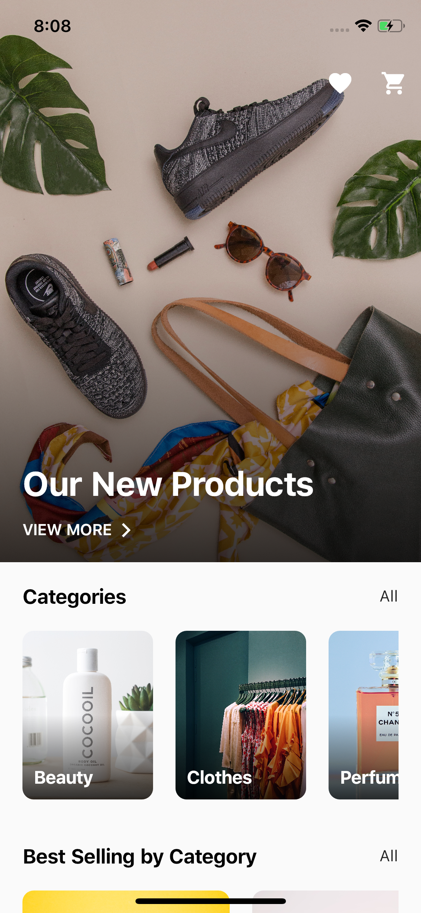

## Flutter e-commerce Application UI Design and Animation

A part of #flutter100daysofcode. Let's create a beautiful and animated e-commerce UI with Flutter.

<br>

## Development Setup
Clone the repository and run the following commands:
```
flutter pub get
flutter run
```

## ScreenShot

&nbsp;

## Links

* [Website](https://greenpc.dev)
